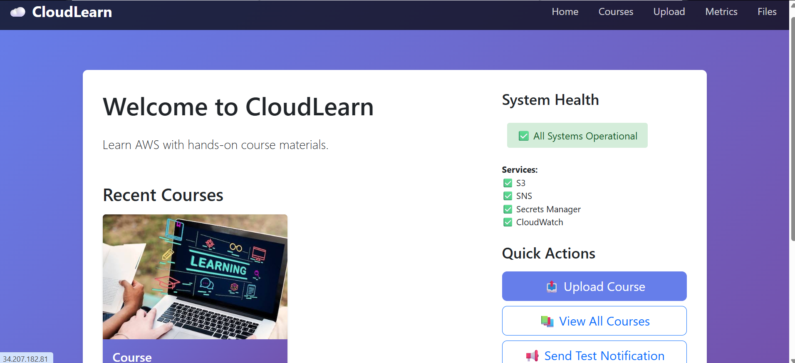

# CloudLearn Business Use Case

## Business Use Case

CloudLearn is a learning platform for instructors to publish course materials and for students to browse and download course content. It is designed for early-stage training providers who want a secure, cloud-native platform without a full database and application stack.



Primary business value:
- Upload course content and thumbnails
- Store files securely in AWS S3
- Manage course metadata in PostgreSQL
- Deliver content to users via a web interface
- Track application health and usage with CloudWatch
- Send notifications when needed via SNS

## AWS Services Used

### Amazon S3
- Stores course material files and thumbnail images.
- Keeps binary content out of the application and database.
- Supports serving images and download links securely.
- S3 bucket encryption is enabled using a KMS key.

### AWS KMS
- Provides encryption for S3 objects.
- Ensures course materials and thumbnails are encrypted at rest.
- Protects sensitive content with managed key policies.

### Amazon RDS / PostgreSQL
- Stores course metadata such as title, description, instructor, and S3 object keys.
- Keeps searchable application data in a relational database.
- Enables persistent storage of courses beyond app restarts.

### AWS Secrets Manager
- Stores configuration and credentials in a single secret.
- Keeps S3 bucket name, SNS topic ARNs, and database credentials secure.
- Allows the application to retrieve secrets at runtime without hardcoding them.

### AWS SNS
- Sends test notifications from the application.
- Demonstrates event-driven messaging and alerting.

### Amazon CloudWatch
- Receives custom metrics: Uploads, Notifications, HealthChecks, Errors, Deletes.
- Captures application logs for upload events, notification events, and errors.
- Provides monitoring and dashboard capabilities for demos.

### IAM Roles
- Gives the EC2 instance or application permissions to access Secrets Manager, S3, SNS, KMS, and CloudWatch.
- Ensures least-privilege access to AWS resources.
- The app runs from an EC2 instance profile so it can call AWS services without hardcoded credentials.
- For this demo, a single EC2 instance is sufficient for the application and file upload flows.
- For production, use one or more EC2 instances behind a load balancer plus a managed RDS database.

Recommended IAM permissions for the EC2 role:
- `secretsmanager:GetSecretValue` on the CloudLearn secret.
- `s3:ListBucket`, `s3:GetObject`, `s3:PutObject`, `s3:DeleteObject` on the upload bucket.
- `kms:Decrypt`, `kms:Encrypt`, `kms:GenerateDataKey` on the encryption key.
- `sns:Publish` on the notification topic.
- `cloudwatch:PutMetricData`, `logs:CreateLogStream`, `logs:PutLogEvents` for metrics and logging.

## Why Each Service is Here

- **S3**: Store course files and thumbnails securely and cheaply.
- **KMS**: Encrypt S3 objects at rest so content is protected by key management.
- **PostgreSQL**: Keep course metadata in a structured, queryable format.
- **Secrets Manager**: Hide credentials and configuration secrets away from source code.
- **SNS**: Provide a simple notification channel for event alerts.
- **CloudWatch**: Track usage, health, and errors for operational visibility.
- **IAM Roles**: Control permissions for secure AWS service access.

## Setup Overview

1. Clone the repository:
   ```bash
   git clone https://github.com/iyas311/aws-resources-learn_app/
   cd aws-resources-learn_app
   ```

2. Provision AWS resources and instance:
   - Create an S3 bucket for file uploads.
   - Enable KMS encryption on the bucket using a KMS key.
   - Create an SNS topic for notifications.
   - Create an IAM role with permissions for S3, KMS, Secrets Manager, SNS, and CloudWatch.
     - Attach the IAM role to the EC2 instance using an instance profile.
     - Grant only the permissions needed by the app, not full admin rights.
   - Launch a single EC2 instance for the app.
     - One instance is enough for a demo and development environment.
     - For higher availability, use multiple EC2 instances behind a load balancer.
   - Open inbound security group ports for HTTP (80) and SSH (22).
   - Install Python, PostgreSQL, and Git on the EC2 instance.

3. Prepare the EC2 app environment:
   - SSH into the instance:
     ```bash
     ssh -i /path/to/key.pem ec2-user@<EC2-IP>
     ```
   - Update packages and install Python:
     ```bash
     sudo yum update -y
     sudo yum install python3 git -y
     ```
   - Clone the repo inside EC2:
     ```bash
     git clone https://github.com/iyas311/aws-resources-learn_app/
     cd aws-resources-learn_app/app
     ```
   - (Optional) Use a virtual environment:
     ```bash
     python3 -m venv venv
     source venv/bin/activate
     ```

4. Install dependencies:
   ```bash
   pip install -r requirements.txt
   ```

5. Set up Secrets Manager:
   - Create a secret named `cloudlearn-app`.
   - Store values in JSON format including:
     ```json
     {
       "bucket_name": "your-s3-bucket-name",
       "kms_key_id": "arn:aws:kms:us-east-1:123456789012:key/your-kms-key-id",
       "sns_topic_arn": "arn:aws:sns:...",
       "db_host": "<database-host>",
       "db_port": "5432",
       "db_name": "cloudlearn",
       "db_username": "cloudlearn",
       "db_password": "StrongPassword123!"
     }
     ```
   - Grant the EC2 IAM role permission to read this secret.

6. Set up PostgreSQL:
   - Install PostgreSQL on EC2 or use Amazon RDS.
   - Create the database and user:
     ```sql
     sudo -u postgres psql
     CREATE DATABASE cloudlearn;
     CREATE USER cloudlearn WITH PASSWORD 'StrongPassword123!';
     ALTER ROLE cloudlearn SET client_encoding TO 'utf8';
     ALTER ROLE cloudlearn SET default_transaction_isolation TO 'read committed';
     ALTER ROLE cloudlearn SET default_transaction_deferrable TO on;
     ALTER ROLE cloudlearn SET default_transaction_read_uncommitted TO off;
     GRANT ALL PRIVILEGES ON DATABASE cloudlearn TO cloudlearn;
     \q
     ```
   - If you use EC2-hosted PostgreSQL, enable local access and restrict remote access to the app host only.
   - If you use RDS, keep the database in a private subnet and allow only the app security group to connect.

7. Run the app on EC2:
   ```bash
   cd aws-resources-learn_app/app
   source venv/bin/activate   # if used
   python3 -m uvicorn app.main:app --host 0.0.0.0 --port 80
   ```

8. Access the UI:
   - `http://<EC2-IP>/upload-course` to upload new courses
   - `http://<EC2-IP>/courses` to browse existing courses
   - `http://<EC2-IP>/metrics` to view the metrics dashboard
   - `http://<EC2-IP>/files-page` to inspect S3 files

9. Optional production improvements:
   - Use an Application Load Balancer in front of the EC2 instance.
   - Use HTTPS with ACM certificates.
   - Configure the app to run as a systemd service.
   - Use RDS for managed PostgreSQL instead of self-hosted EC2 Postgres.

## Repository Link
- https://github.com/iyas311/aws-resources-learn_app/

## Summary

CloudLearn combines file storage, metadata persistence, secret management, messaging, and monitoring to demonstrate a practical cloud learning platform architecture. The app is designed to show how AWS-native services work together to secure and manage course content while maintaining a simple frontend experience.
